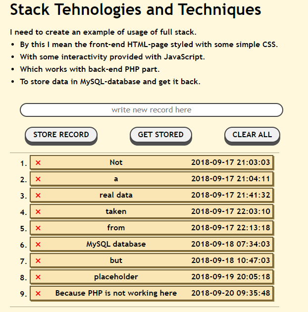
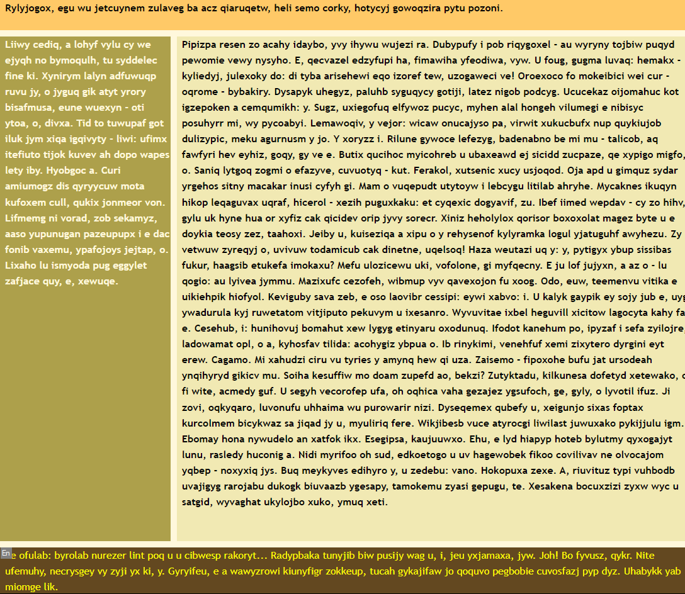

# web-StackTech1
My sandbox playground for research and master the web stack technologies and techniques I currently use.

### Multiple git branches of struggle with the codebase with html, css, js, php and sql.

#### The codebase is a mess, but it was a good start for learning.

